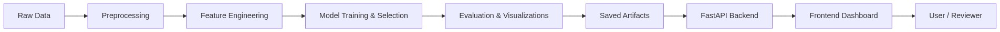

# FreightAI

FreightAI is a freight rate prediction assessment project with a full ML pipeline, a FastAPI backend, and a static frontend dashboard. The repository is organized so reviewers can quickly find the source code, generated deliverables, and archived raw inputs.

## What's Included

- End-to-end training flow: preprocessing, feature engineering, model selection, tuning, and evaluation
- FastAPI service for predictions, metrics, downloads, and the static frontend
- Static frontend pages for dashboarding, analysis, and forecasting
- Submission-ready outputs in `deliverables/`

## Repository Map

| Path | Purpose |
|---|---|
| [project/](project) | Main application code, including backend, frontend, tests, models, and reports |
| [deliverables/](deliverables) | Final PDF report, exported predictions, and key visual assets |
| [archive/](archive) | Raw datasets and intermediate files kept for reference |
| [tools/](tools) | Utility scripts used during development and debugging |

## Visual Overview



## Quick Start

1. Create and activate a Python 3.10+ virtual environment.

```powershell
python -m venv .venv
. .venv\Scripts\Activate.ps1
pip install -r project/requirements.txt
```

2. Run the backend tests.

```powershell
cd project
pytest backend/tests -q
```

3. Train the model and generate artifacts.

```powershell
python project/backend/train.py
python project/backend/predict.py
```

4. Start the app and open the UI.

```powershell
python project/backend/app.py
# http://localhost:8000
```

The FastAPI app serves the API, charts, and frontend from port 8000.

## Submission Notes

- The main code lives under [project/](project); the generated submission assets now live under [deliverables/](deliverables) in clearly organized folders.
- If you are reviewing the repo on GitHub, start with this README, then open [project/README.md](project/README.md) for the fuller technical write-up.
- The [archive/](archive) folder is intentionally preserved so the original inputs and templates remain available.

## Validation

- Backend tests are available under [project/backend/tests](project/backend/tests).
- The training and prediction scripts produce the CSV outputs stored in [deliverables/exports](deliverables/exports) and related charts in [deliverables/plots](deliverables/plots).
- The generated architecture image is stored at [deliverables/architecture.png](deliverables/architecture.png).

## License

MIT License - see [project/LICENSE](project/LICENSE)
