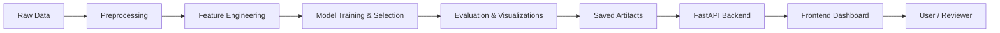

# FreightAI — Freight Rate Prediction (Assessment)

High-quality, production-oriented freight rate prediction platform. This repository contains the complete assessment deliverables including the ML training pipeline, model artifacts, prediction scripts, a FastAPI backend and a responsive frontend dashboard.

--

## Highlights

- Production-style training pipeline (preprocessing → features → model selection → HPO → evaluation)
- FastAPI backend serving predictions and metrics
- Responsive frontend for visualization and batch upload
- Deliverables exported in `deliverables/` for easy submission

## Quick Links

- Project code: [project](project)
- Deliverables (report, predictions, charts): [deliverables](deliverables)
- Archived raw files: [archive](archive)
- Utility scripts: [tools](tools)

## Architecture (high level)



## Folder structure (important)

- `project/` — main application code (backend + frontend)
	- `project/backend` — FastAPI backend, training and prediction scripts
	- `project/frontend` — static UI (HTML/CSS/JS)
- `deliverables/` — final report, predictions, and charts ready for submission
- `archive/` — raw data and intermediate files kept for reference
- `tools/` — helper scripts used during development

## Quick start (recommended for reviewers)

1. Create and activate a Python 3.10+ virtual environment

```powershell
python -m venv .venv
. .venv\Scripts\Activate.ps1
pip install -r project/requirements.txt
```

2. Run unit tests (backend)

```powershell
cd project
pytest backend/tests -q
```

3. Train the model (this will generate `project/backend/models` and charts)

```powershell
python project/backend/train.py
```

4. Generate prediction artifacts (validation + December forecast)

```powershell
python project/backend/predict.py
```

5. Run the API locally

```powershell
python project/backend/app.py
# open http://localhost:8000/docs for interactive API docs
```

6. Serve the frontend (optional) from the `project/frontend` folder

```powershell
cd project/frontend
python -m http.server 3000
# open http://localhost:3000
```

## What I validated for this submission

- Backend tests pass (`project/backend/tests`) — run `pytest` to verify.
- Training pipeline runs end-to-end and produces model artifacts under `project/backend/models`.
- Prediction scripts produce `validation_predictions.csv` and `december_chart_predictions.csv` (also copied to `deliverables/`).

## Notes for deployment

- The FastAPI app is configured to serve the frontend static files if the `project/frontend` folder is present. To deploy to Vercel you can link this repository and configure the build step to only serve the static `project/frontend` content or deploy the backend separately (e.g., Render, Fly, or a Docker container).

## Contributing / Checklist before final submission

- Remove large raw datasets from the repo if you plan to publish publicly (they are kept in `archive/`).
- Record a short 2–3 minute walkthrough (Loom) showing the folder structure, how to run the project, and the results.
- Export the report `project/backend/reports/FreightAI_Assessment_Report.docx` to PDF if needed and include it in `deliverables/`.

---

If you want, I can also add a rendered PNG of the architecture diagram to `deliverables/` and update the GitHub repository `README` preview with that image. Would you like me to do that and push the change now?


